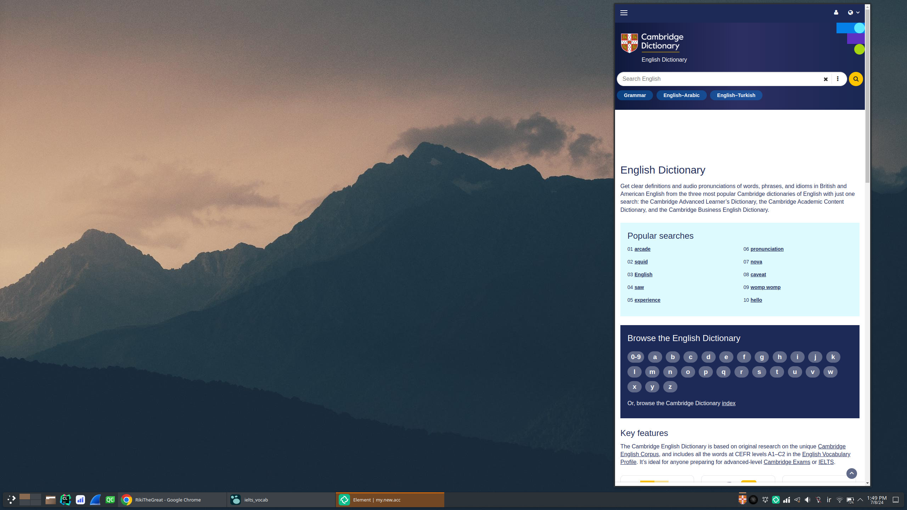

#  Cambridge dictionary widget for plasma 6

## How to run

clone the repository
```
    git clone https://github.com/RikiTheGreat/com.RikiTheGreat.CambridgeDict-plasma6.git
```

then move the folder to

```
    ~/.local/share/plasma/plasmoids/
```


